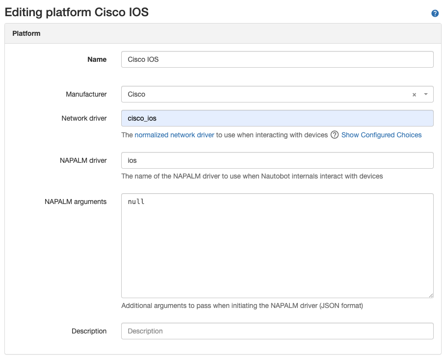

# Using the App

This document describes common use-cases and scenarios for this App utilizing the exposed SSoT jobs.

## General Usage

This App can be used in three general ways.

1. Onboard a device with basic information. (Name, Serial, Device Type, Management IP + Interface)
2. Take existing devices and enhace the data for each device by syncing in more metadata. (Interface, VLANs, VRFs etc.)
3. Both 1 and 2 in conjunction with each other.

### Preparation

To properly onboard a device, a user needs to provide, at a minimum:

1. The Device's Location
2. The Device's primary IP address or DNS Name
3. Selecting other attributes metadata needed. (Default statuses, roles, etc.)

!!! note
    For DNS Name Resolution to work, the Celery instance of Nautobot must be able to resolve the name of the device to IP address.

If `Platform`, `Device Type` and/or `Role` are not provided, the plugin will try to identify this information automatically and, based on the settings, it can create them in Nautobot as needed.

!!! note
    The SSoT jobs use nornir-netmiko to run the show commands defined in the command mappers.

#### SSH Autodetect

The `nautobot-device-onboarding` apps `Sync Devices` job recognizes platform types with a Netmiko SSH Autodetect mechanism. The user may need to specify additional information for platforms where Netmiko's `ssh_autodetect` feature does not work.

[Here is the list](https://github.com/ktbyers/netmiko/blob/v3.4.0/netmiko/ssh_autodetect.py#L50) of platforms supported by `ssh_autodetect`.

The `nautobot-device-onboarding` app can be used with any devices that are supported by NAPALM. Even custom NAPALM driver plugins can be used with a bit of effort.

The table below shows which common platforms will be SSH auto-detected by default.

|Platform     |Platform Autodetect|
--------------|--------------------
Juniper/Junos | Yes (when running Netconf over SSH)|
Cisco IOS-XE  |Yes|
Cisco NXOS (ssh) | Yes|
Cisco NXOS (nxapi)| No|
Arista EOS | No|

For the platforms where SSH auto-detection does not work, the user will need to:

1. Select the platform in the job inputs form.

### IOS and Junos Auto-Created Platforms

The Onboarding App will automatically create Platforms for vendor operating systems where platform auto-detection works. The picture below shows the details of auto-created Platforms for `cisco_ios` and `juniper_junos`.




## Use-cases and common workflows


### Onboard a New Device

A new device can be onboarded via :

- A SSoT job execution.
    - Via Jobs menu
    - Via SSoT Dashboard
- API, via a `POST` to `/api/extras/jobs/TODO/run` or `/api/extras/jobs/{id}/run` 

!!! note
    The SSoT Job's ID (UUID) will be different per Nautobot instance. 

During a successful onboarding process, a new device will be created in Nautobot with its management interface and its primary IP assigned. The management interface will be discovered on the device based on the IP address provided.

This SSoT job supports a bulk CSV execution option to speed up this process.

### Consult the Status of the Sync Network Devices SSoT Job

The status of onboarding jobs can be viewed via the UI (Jobs > Job Results) or retrieved via API (`/api/extras/job-results/`) with each process corresponding to an individual Job-Result object.

# API

To run the SSoT Sync Devices Job via the api:


Post to `/api/extras/jobs/TODO/run/` with the relevent onboarding data: 

```bash
curl -X "POST" <nautobot URL>/api/extras/jobs/TODO/run/ -H "Content-Type: application/json" -H "Authorization: Token $NAUTOBOT_TOKEN" -d '{"data": {"location": "<valid location UUID>", "ip_address": "<reachable IP to onboard>", "port": 22, "timeout": 30}}
```

Required Fields:
    location: Location UUID
    ip_address: String of IP or CSV of IPs
    port: Integer
    timeout: Integer

Optional Fields:
    credentials: Secret Group UUID
    platform: Platform UUID
    role: Role UUID
    device_type: Device Type UUID
    continue_on_failure: Boolean

### Enhace Existing Device

A existing devices data can be expanded to include additonal objects by:

- A SSoT job execution.
    - Via Jobs menu
    - Via SSoT Dashboard
- API, via a `POST` to `/api/extras/jobs/TODO/run` or `/api/extras/jobs/{id}/run` 

!!! note
    The SSoT Job's ID (UUID) will be different per Nautobot instance. 

During a successful network data sync process, a devices related objects will be created in Nautobot with all interfaces, their IP addresses, and optionally VLANs, and VRFs.

### Consult the Status of the Sync Network Data SSoT Job

The status of onboarding jobs can be viewed via the UI (Jobs > Job Results) or retrieved via API (`/api/extras/job-results/`) with each process corresponding to an individual Job-Result object.

# API

To run the SSoT Sync Devices Job via the api:


Post to `/api/extras/jobs/TODO/run/` with the relevent onboarding data: 

```bash
curl -X "POST" <nautobot URL>/api/extras/jobs/TODO/run/ -H "Content-Type: application/json" -H "Authorization: Token $NAUTOBOT_TOKEN" -d '{"data": {"devices": "<valid devices UUID>"}
```

Required Fields:
    devices: Location UUID
